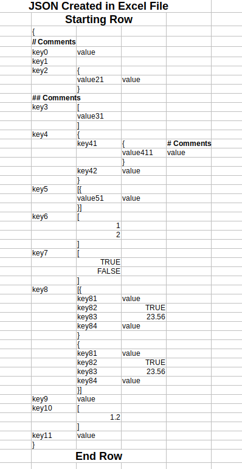

# ExcelToJSON

Its a tool to generate a JSON file from Excel data.


- Clone the project
- Build the project in maven(mvn clean install)
- Copy the file **ExcelToJSON-jar-with-dependencies.jar** from target folder to a folder
- In the console enter: **java -jar ExcelToJSON-jar-with-dependencies.jar**, then you will see <br/>
Enter : &lt;Excel File Name&gt;:&lt;Excel Sheet Name&gt; &lt;JSON File name&gt; <br/>
or<br/>
**java -jar ExcelToJSON-jar-with-dependencies.jar "SampleData.xlsx:Testcase4" testResult1.json** <br/>
where **SampleData.xlsx** is the Excel file and **Testcase1** is the Sheet name <br/><br/>

**Input Sample Excel Data** <br/>
<br/>
**Output Sample JSON Data**
```
{
    "sample1": {
        "sample11": 678689,
        "sample12": {
            "sample121": "Hello",
            "sample122": "Bhai"
        },
        "sample13": true
    },
    "sample2": [
        1212,
        12312
    ],
    "sample3": [
        "Hello",
        "World"
    ],
    "sample4": [{
        "Testing1": "Dummy",
        "Testing2": "Dummy"
    }],
    "sample5": [
        true,
        false,
        false
    ]    
}
```
